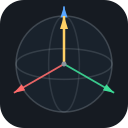

#  Playground | Quantum Circuit Simulator

A drag-and-drop, multi-qubit quantum circuit simulator that runs entirely in the browser. Build circuits by dragging gates onto qubit wires, watch per-qubit Bloch spheres update live, and measure results over a configurable number of shots.

There is no installation required, just go to https://bits-and-electrons.github.io/playground/.

## Features
- Drag-and-drop gate placement on a multi-qubit circuit (add/remove qubits on the fly)
- Live Bloch sphere visualization per qubit
- Configurable shot count with measurement results/histogram
- Built-in examples (Superposition, 3-qubit Teleportation)
- Export/import circuits as JSON

## Browser Compatibility
The simulator is plain HTML, CSS and JavaScript with no external runtime dependencies, so it works in any modern browser (Chrome, Firefox, Edge, Safari).

## Development
Prerequisite: install [Git](https://git-scm.com/downloads) and [NodeJS](https://nodejs.org/en/download/) on your machine.

### Clone the repository
```
git clone https://github.com/bits-and-electrons/playground
```

### Install dependencies
```
npm install
```

### Run it locally
```
npm start
```
This serves the app at `http://localhost:8080` and opens it in your browser.

## License
See [LICENSE](LICENSE).
